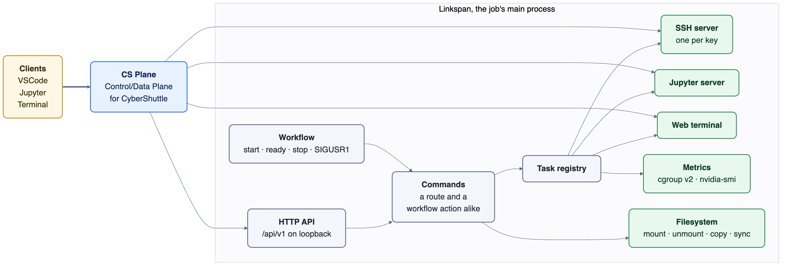

# Linkspan

[](https://github.com/cyber-shuttle/linkspan/actions/workflows/ci.yml)
[](https://github.com/cyber-shuttle/linkspan/releases/latest)
[](go.mod)
[](LICENSE)

**Linkspan turns an HPC batch job into a workspace you can reach from your laptop.** It has subsystems
for the common tools researchers set up by hand, and for the data and process management chores that
come with research on HPC.

- **Jupyter IDE.** A Jupyter server in a folder of the job. Linkspan builds the Python environment for it.
- **VS Code IDE.** An SSH server for one keypair, identified by its public key. VS Code connects to it
  with Remote-SSH.
- **Metrics.** How much CPU, GPU and memory the job is using, from one URL.
- **Terminals.** A shell inside the job, opened from a browser tab.
- **Filesystem (WIP).** Datasets mounted or synced into the job.
- **Checkpoint/Restore (WIP).** A snapshot of the job's running processes, so a later job can resume them.
- **Workflows (WIP).** Steps that run at set points in the job's life, from a file. Each action is also a
  route of the HTTP API.



Compute nodes sit behind a login node and a firewall. To get through, the client creates a
[Dev Tunnel](https://learn.microsoft.com/en-us/azure/developer/dev-tunnels/overview) and Linkspan hosts
it from inside the job. The tunnel decides who may connect.

Most people use Linkspan through a client. [cs-bridge](https://github.com/cyber-shuttle/cs-bridge) is our
VS Code extension. [cs-jupyter](https://github.com/cyber-shuttle/cs-jupyter) is our JupyterLite
distribution. cs-bridge and cs-control submit the job, reach it through the tunnel and connect the IDE.
This document is about running Linkspan yourself.

There are four ways to use Linkspan, and they mix. Run it as the main process of a batch job. Drive it
with a workflow file. Drive it over the HTTP API. Reach it from another step of the same job. The sections
below cover them in that order, after installation and a quick start.

## Installation

```bash
curl -fsSL https://github.com/cyber-shuttle/linkspan/releases/latest/download/linkspan_Linux_x86_64.tar.gz |
  tar -xz linkspan
```

Archives exist for Linux and macOS on `x86_64` and `arm64`. [CHANGELOG.md](CHANGELOG.md) lists the
versions. [CONTRIBUTING.md](CONTRIBUTING.md#development-setup) explains how to build from source.

### Requirements

- Metrics need Linux with cgroup v2 laid out the way Slurm does it. The macOS builds run but report no
  metrics.
- GPU metrics need `nvidia-smi` on `PATH`. Without it, the GPU field is left out.
- `--tunnel-enable` needs outbound HTTPS to `tunnelsassetsprod.blob.core.windows.net` to fetch the
  `devtunnel` CLI, and then to the Dev Tunnels service at `devtunnels.ms` and
  `rel.tunnels.api.visualstudio.com`.
- Jupyter needs `curl` on `PATH`, and outbound HTTPS to `astral.sh` and `github.com` for `uv` and its
  Python, and to `pypi.org` for packages. Terminals need `github.com` for `ttyd`, and work on Linux only.
- The home directory must be writable. Everything Linkspan fetches or builds goes under `~/.cybershuttle/`.

## Quick start

Create a Dev Tunnel on your laptop with `devtunnel create`, and mint a host token for it with
`devtunnel token <id> --scopes host`. Then start Linkspan inside the job, hosting that tunnel.

```bash
./linkspan --port 8080 --tunnel-enable \
  --tunnel-id <id> --tunnel-cluster <cluster> --tunnel-host-token <token> &
```

Start a Jupyter server on a folder of the job.

```bash
curl -X POST http://127.0.0.1:8080/api/v1/jupyter/sessions \
  -H 'Content-Type: application/json' -d '{"root_dir": "/home/me/project"}'
```

The reply gives you the server's `url` on the tunnel and its `token`. Open the URL in a browser with the
token, from anywhere. The first server builds its Python environment under `~/.cybershuttle/`, which
takes a few minutes. Later servers reuse it.

Start an SSH server for your public key.

```bash
curl -X POST http://127.0.0.1:8080/api/v1/vscode/sessions \
  -H 'Content-Type: application/json' \
  -d "{\"authorized_key\": \"$(cat ~/.ssh/id_ed25519.pub)\"}"
```

The reply gives you the server's `bind_port`. Add that port to the tunnel with `devtunnel port create <id>
-p <bind_port>`, forward it to your laptop with `devtunnel connect <id>`, and point VS Code Remote-SSH at
`127.0.0.1:<bind_port>`.

Every server Linkspan starts stops when Linkspan stops. So when a batch job runs Linkspan as its main
process, the whole workspace ends at the job's time limit.

## Usage

### As a batch job

A client creates the tunnel and makes a token that only allows hosting. Then it submits the job. The job
runs Linkspan as its main process, with a workflow that sets up the workspace. The CyberShuttle clients do
all of this for you. The script below is what they submit.

```bash
#!/bin/bash
#SBATCH --signal=B:USR1@120
exec linkspan --port "$PORT" \
  --tunnel-enable \
  --tunnel-id "$CS_TUNNEL_ID" \
  --tunnel-cluster "$CS_TUNNEL_CLUSTER" \
  --tunnel-host-token "$CS_TUNNEL_HOST_TOKEN" \
  --workflow workflow.yaml
```

The first time it runs, Linkspan downloads Microsoft's `devtunnel` CLI and uses it as the relay. Each
Jupyter server or terminal it starts is added to the tunnel while it runs, and you get back its public
URL. If the relay fails or exits, Linkspan exits with a failure status. `--signal` tells Slurm to send
`SIGUSR1` two minutes before the time limit, and a workflow step can react to it.

### Workflows

A workflow sets up a workspace and tears it down, all from one file. A job can checkpoint before its time
limit and sync its results on exit, with no trap handlers in the batch script.

A workflow is a list of steps. Each step names a trigger with `on`, and `start` is the default. Each step
has one action with its `params`, or a `tasks` list of several. `shell.exec` runs a command. Any other
action is one Linkspan offers, named by subsystem and verb, and its `params` are the same as the request
body of the matching route. A trigger's tasks run in order and stop at the first failure. That failure
exits Linkspan with status 1.

| Trigger | When |
|---|---|
| `start` | The listeners are up. |
| `ready` | After the `start` steps, once the tunnel relay is hosting; at once when no tunnel is hosted. |
| `stop` | Linkspan was told to exit, before anything is torn down, so the API still answers. |
| `SIGUSR1`, `SIGUSR2`, `SIGHUP` | The signal arrived, as Slurm's `--signal` sends it before the time limit. |

| Action | Does | `params` |
|---|---|---|
| `shell.exec` | Runs `command`, split on whitespace, without a shell | `command` |
| `vscode.sessions.select`, `jupyter.sessions.select`, `terminal.sessions.select` | Lists that subsystem's sessions | |
| `vscode.sessions.start` | Starts an SSH server for a key | `authorized_key` |
| `jupyter.setup` | Builds the Jupyter environment ahead of the first server | |
| `jupyter.sessions.start` | Starts a Jupyter server | `root_dir`, `addr`, `token` |
| `jupyter.sessions.stop` | Stops one | `id` |
| `terminal.sessions.start` | Starts a web terminal | `cwd` |
| `terminal.sessions.stop` | Stops one | `id` |
| `filesystem.mount`, `.unmount`, `.copy`, `.sync` | Declared, not yet implemented; answer `501` | |

```yaml
name: workspace
steps:
  - on: start
    tasks:
      - name: Warm the cache
        action: shell.exec
        params:
          command: /home/me/warm.sh
      - name: Build the Jupyter environment
        action: jupyter.setup
  - on: ready
    tasks:
      - name: VS Code
        action: vscode.sessions.start
        params:
          authorized_key: ssh-ed25519 AAAA... me@laptop
      - name: Jupyter
        action: jupyter.sessions.start
        params:
          root_dir: /home/me/project
  - name: Checkpoint before the time limit
    on: SIGUSR1
    action: shell.exec
    params:
      command: /home/me/checkpoint.sh
  - name: Sync results
    on: stop
    action: shell.exec
    params:
      command: /usr/bin/rsync -a /scratch/me/out/ /home/me/out/
```

A command runs without a shell, so there are no globs, variables, pipes or redirects. A bare command name
is looked up on Linkspan's `PATH`. An action from a disabled subsystem, or an unknown trigger, is refused
before anything starts. [`examples/workflow.yml`](examples/workflow.yml) tries each kind of trigger against a
local Linkspan. Run it, list `/api/v1/jupyter/sessions`, send `SIGUSR1`, then send `SIGTERM`. Each
`shell.exec` step prints a line.

### Reaching a job from inside the cluster

`--socket` adds a unix socket listener. Then a caller elsewhere in the cluster can reach the job through a
Slurm step, with no TCP port. The batch script creates the folder with mode `0700` and without `-p`, so if
another user created it first, the job fails. Linkspan replaces a stale socket, refuses any other file at
the path, and removes the socket on exit.

```bash
mkdir -m 700 "/tmp/linkspan-$SLURM_JOB_ID" && linkspan --port "$PORT" --socket "/tmp/linkspan-$SLURM_JOB_ID/api.sock"
```

A unix socket only connects on the same node, even on a shared filesystem, so the caller uses a Slurm step
to land on the job's node. Each call costs a step's scheduling time, so the socket suits occasional
requests rather than polling.

```bash
srun --jobid=<id> --overlap --mem=0 curl --unix-socket /tmp/linkspan-<id>/api.sock http://localhost/api/v1/metrics
```

## Configuration

| Flag | Default | Description |
|---|---|---|
| `--port` | `8080` | HTTP port, bound on loopback; `0` picks a free one |
| `--socket` | | Also serve on this unix socket path |
| `--workflow` | | Workflow YAML file |
| `--tunnel-enable` | `false` | Host the tunnel named by `--tunnel-id` |
| `--tunnel-id` | | Id of the tunnel the client created; required with `--tunnel-enable` |
| `--tunnel-cluster` | | Cluster id of `--tunnel-id`; required with `--tunnel-enable` |
| `--tunnel-host-token` | | Access token scoped to hosting; required with `--tunnel-enable` |
| `--version` | | Print the version and exit |

Each capability is a subsystem that can be on or off. A subsystem that is off has no routes, answers
`404`, and offers no workflow action. The on/off set is written into `main.go` until a config file replaces
it.

| Subsystem | Shipped | Offers |
|---|---|---|
| `vscode` | on | SSH servers for VS Code Remote-SSH |
| `jupyter` | on | Jupyter servers in a `uv`-built environment |
| `terminal` | off | `ttyd` web terminals, Linux only |
| `filesystem` | off | Mount, unmount, copy and sync, declared and not yet implemented |

## HTTP API

Requests carry no password or token. Access is controlled by how you reach Linkspan: the loopback port,
the `0600` socket, or the tunnel the client owns. The port lets in every user on the node, so it assumes
the job has the node to itself. The socket lets in only the job's user. [SECURITY.md](SECURITY.md) explains
the model.

| Method | Path | Answers |
|---|---|---|
| GET | `/api/v1/health` | `{"status":"ok"}` |
| GET | `/api/v1/metrics` | `{"memBytes":<n>,"cpuUsageUsec":<n>,"gpus":[{"index":<n>,"utilPct":<n>,"memUsedMiB":<n>,"memTotalMiB":<n>}]}`; a missing source omits its field, and the object is the last sample of a 5s loop |
| GET | `/api/v1/vscode/sessions` | `[{"id":"s-<port>","addr":"127.0.0.1:<port>","state":"<state>","error":""}]`, ordered by id, `[]` when none |
| POST | `/api/v1/vscode/sessions` | `201` with `{"id":"s-<port>","bind_port":<port>}` |
| GET | `/api/v1/jupyter/sessions` | `[{"id":"j-<port>","addr":"127.0.0.1:<port>","state":"<state>","error":"","url":"<public url>","root_dir":"<dir>","token":"<token>"}]`, ordered by id |
| POST | `/api/v1/jupyter/sessions` | `201` with one session object; takes `{"root_dir": "<dir>"}`, default Linkspan's own directory |
| DELETE | `/api/v1/jupyter/sessions/{id}` | `{"id":"j-<port>","state":"stopped"}`, `404` for an unknown id |
| POST | `/api/v1/jupyter/setup` | `200` once the environment is built, which takes minutes the first time |
| GET | `/api/v1/terminal/sessions` | `[{"id":"t-<port>","addr":"127.0.0.1:<port>","state":"<state>","error":"","url":"<public url>","cwd":"<dir>"}]`, ordered by id |
| POST | `/api/v1/terminal/sessions` | `201` with one session object; takes `{"cwd": "<dir>"}`, default Linkspan's own directory |
| DELETE | `/api/v1/terminal/sessions/{id}` | `{"id":"t-<port>","state":"stopped"}`, `404` for an unknown id |
| POST | `/api/v1/filesystem/{mount,unmount,copy,sync}` | `501` when the subsystem is on: declared, not yet implemented. Off as shipped, so `404` |

Every POST reports an error as `{"error": "<message>"}`. The status is `400` when the body cannot be
parsed and `413` when it is over 64KB. A route of a subsystem that is off answers `404`.

A VS Code session is one SSH server. It listens on loopback, accepts one keypair identified by its public
key, and runs commands through `sh`. The POST takes `{"authorized_key": "<ssh public key>"}`. The key
must be bare, with no `authorized_keys` options, or it is refused with `400`. The port is already
accepting when the reply arrives.

A Jupyter server or terminal starts in state `starting`. It becomes `running` once its port accepts, no
matter how long that takes. It becomes `failed`, with `error` set, if it exits first. It becomes `exited`
if it ends on its own. Poll the list to follow it. A folder that does not exist fails the server, not the
request. The port is added to the hosted tunnel when the server starts and removed when it ends. `url` is
the port's address on the tunnel, and is empty when no tunnel is hosted. A Jupyter server's port is
anonymous on the tunnel, and its token is the only credential, so a browser reaches it with the token
alone. A terminal's port is not anonymous. A browser signs in as the tunnel's owner. Any other client
sends `X-Tunnel-Authorization: tunnel <connect token>`. `addr` pins a Jupyter server to a loopback port of
your choice, and `token` sets its token. Without them, Linkspan picks a free port and takes the token from
`JUPYTER_TOKEN` in its own environment, or makes one up. Terminals answer `501` on anything but Linux.

## Architecture

Linkspan is one static Go binary built on three ideas.

Everything that runs is a task. The HTTP listeners, the relay, the metrics sampler, the workflow, each SSH
server and each Jupyter or `ttyd` child are all entries in one registry. Each is a function under a
context, with an id, an address and a state. Starting a task binds its address first, so its port is
reserved before the caller gets a reply, and an in-process server is already accepting. Stopping
Linkspan cancels every task and waits for it. A child process runs in its own process group and is
killed with it. Every child is forked through one path.

A command is both a route and a workflow action. Each subsystem exports a table of commands, which are
plain functions that take a map of params. Each also exports a route table that points at them. The
router decodes the request body into the params. The workflow passes a step's `params` as the same map.
So `POST /api/v1/jupyter/sessions` and a `jupyter.sessions.start` step run the same function. A test
checks that every command is behind a route.

Building blocks are put together where they are used. `internal/` holds the router, the task registry and
the building blocks: the SSH server, the relay and port publishing, the metrics sampler, the
`~/.cybershuttle/` installer, and the list and stop commands the session subsystems share. A subsystem
puts them together into a task at the point where it starts one.

```
main.go          flags, the subsystem table, startup and shutdown
internal/
  router/        a tree of routers; every route is a command
  tasks/         the registry: Start, Select, Stop, StopAll, and Exec, the one fork path
  sshd/ tunnel/ metrics/ install/
  sessions/      the list and stop commands the session subsystems share
subsystems/
  workflow/      YAML steps on start, ready, stop and signals
  vscode/ jupyter/ terminal/ filesystem/
```

[CONTRIBUTING.md](CONTRIBUTING.md) has the full source layout, the file layout rules a test enforces, and
the checks CI runs. [docs/COMPATIBILITY.md](docs/COMPATIBILITY.md) lists what the clients depend on.

## Security

Linkspan runs as the user who submitted the job, installs only under `~/.cybershuttle/`, and listens on
loopback. It runs programs it does not ship: `devtunnel`, `ttyd` and `uv`, fetched over HTTPS on first
use; the Python that `uv` installs; `nvidia-smi`; `sh` for SSH sessions; the user's shell for terminals;
and whatever a workflow step names. [SECURITY.md](SECURITY.md) explains the security model and how to
report a vulnerability.

## Clients

- [cs-bridge](https://github.com/cyber-shuttle/cs-bridge) is a VS Code extension. It submits Linkspan as
  a job with a time limit, starts an SSH server for your key over the tunnel, and points VS Code Remote-SSH
  at it.
- [cs-jupyter](https://github.com/cyber-shuttle/cs-jupyter) is a JupyterLite distribution served by
  cs-control, a Jupyter runtime service. cs-control submits Linkspan with a one-step workflow that starts a
  Jupyter server on a port it declared ahead, with the token it exported as `JUPYTER_TOKEN`. It then hands
  the URL to cs-jupyter.

## Contributing

Issues and pull requests go through [GitHub](https://github.com/cyber-shuttle/linkspan/issues).
[CONTRIBUTING.md](CONTRIBUTING.md) explains the process and [CODE_OF_CONDUCT.md](CODE_OF_CONDUCT.md) the
conduct expected.

## License

Linkspan is released under the Apache-2.0 license. See [LICENSE](LICENSE).
